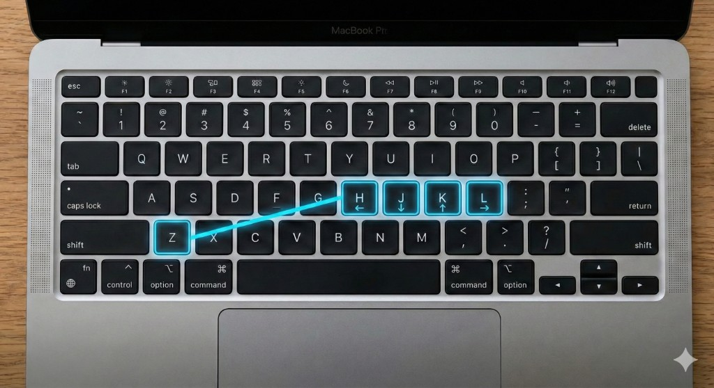
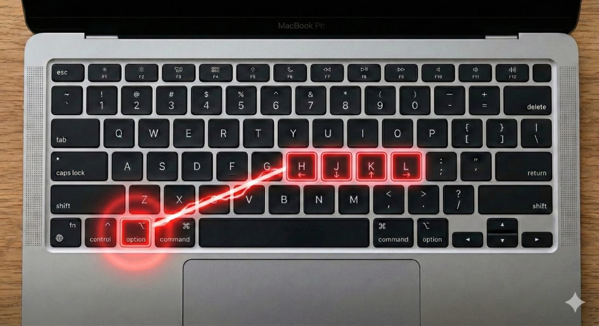

# Option+HJKL to Arrow Keys

Karabiner-Elements 用の設定ファイルです。Option + H/J/K/L で矢印キーとして操作できます。

---

## Mac の既存機能について

Mac には標準で **Control + Z** と **H/J/K/L** を組み合わせた矢印操作があります。

- **Control + Z** を押した状態で **H/J/K/L** → 左/下/上/右



今回の設定は、この考え方をベースにしたオプションです。

---

## 今回の設定について

**Option + H/J/K/L** で矢印キーとして操作できます。



| キー | 動作 |
|------|------|
| Option + H | 左 |
| Option + J | 下 |
| Option + K | 上 |
| Option + L | 右 |

Shift などの他の修飾キーと組み合わせても動作するため、**Option + Shift + K** で「上方向に選択」といった操作も可能です。  
ホームポジションから手を動かさずに、一貫した操作で矢印を使えます。

---

## キーボード操作の簡便化

矢印キーがホームポジション周辺にあるため、キーボード操作がより簡単になり、効率的に作業できます。

---

## 導入方法

1. Karabiner-Elements をインストールする
2. 以下のコマンドを実行する

```bash
curl -o ~/.config/karabiner/assets/complex_modifications/option_hjkl_arrows.json \
  https://raw.githubusercontent.com/AKI-labo65/karabiner-option-hjkl/main/option_hjkl_arrows.json
```

3. Karabiner-Elements → **Complex Modifications** → **Add rule** から「Option+HJKL to Arrow Keys」を有効にする
